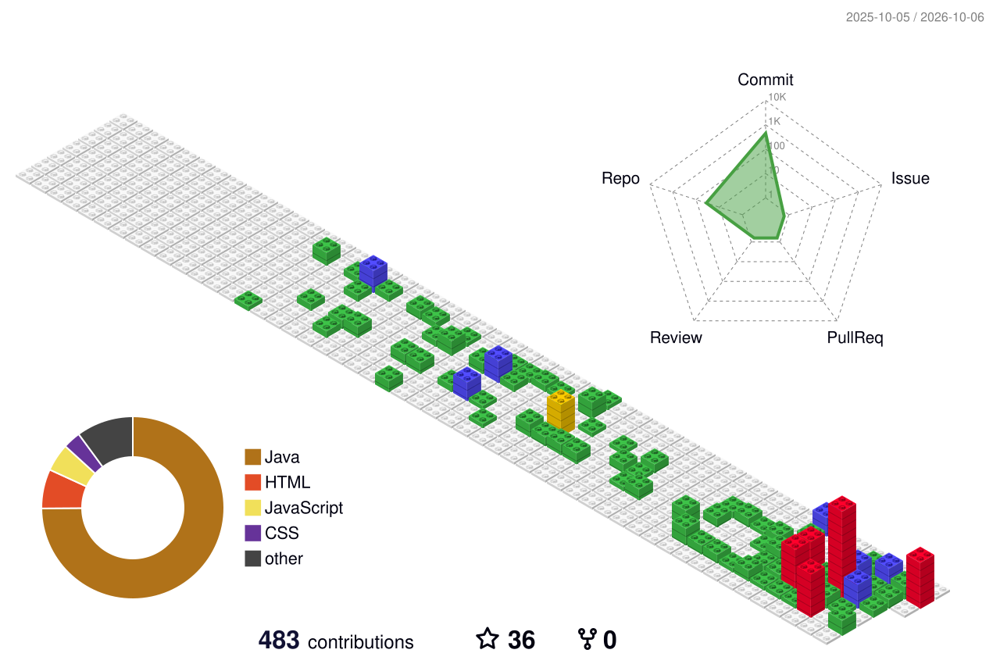

  <!-- Banner Animado Header -->
  

  <!-- Contador Total de Visitas -->
  

    
  

  <!-- Texto Animado (Typing SVG) -->
  

    

  <!-- Gráfico 3D de Contribuições -->
  

    

  <!-- Estatísticas Gerais e Linguagens -->
  
  

<!-- Divisor Animado em Onda -->

###  Sobre Mim

- 🎓 **Formação:** Cursando **Desenvolvimento de Sistemas** no SENAI Suíço-Brasileiro
- ☕ **Foco Principal em Java:** Desenvolvimento Back-End robusto com **Java + Spring Boot**, construindo APIs REST escaláveis (Controller → Service → Repository) com boas práticas de arquitetura
- 🗄️ **Foco Principal em SQL:** Modelagem de bancos de dados relacionais, criação de consultas **SQL avançadas**, manipulação de dados (DDL/DML), otimização com índices e integração via **Spring Data JPA / Hibernate**
- 📚 **Aprofundando Conhecimentos:** Normalização de banco de dados, tuning de queries, DTOs, tratamento de exceções customizado e Clean Code
- 🎯 **Objetivo:** Criar aplicações de alta performance integrando código Java limpo a bancos de dados eficientes
- 📬 **E-mail:** [andrepassosdossantos64@gmail.com](mailto:andrepassosdossantos64@gmail.com)

<!-- Divisor Animado -->

### 🛠️ Tech Stack & Ferramentas (Foco em Java & SQL)

<!-- Ícones Dinâmicos das Tecnologias -->

  

 

<!-- Badges Estilizados Adicionais -->

  
  
  
  
  
  
  

<!-- Divisor Animado -->

### 🐍 Snake Animation (Contribuições no GitHub)

  

<!-- Divisor Animado -->

### 📌 Projetos em Destaque

  
  

  

<!-- Divisor Animado -->

### 📌 Destaques & Interatividade

  <!-- Quote Card -->
  

    

  <!-- Dev Joke Card -->
  

 

### 🌍 Origem dos Visitantes

  

<!-- Rodapé Animado -->

